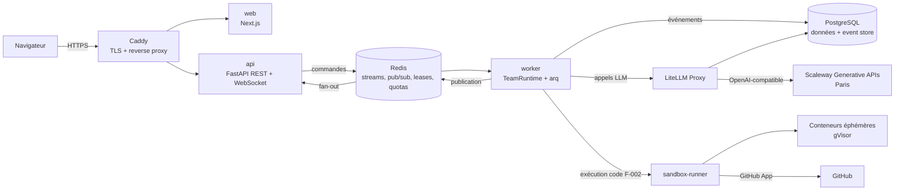

# Architecture — Agentic Agency

Version 0.1 · 2026-10-02 · Statut : **en revue**
Source de vérité technique. Toute PR qui la contredit doit la mettre à jour (voir `CLAUDE.md`).

## 1. Principes
1. **Inspiré d'Akgentic, réimplémenté** (ADR-001) : modèle acteur, AgentCard/TeamCard, catalogue déclaratif, messages typés à intention, event sourcing, couches sans dépendance montante.
2. **Le cœur ne connaît pas l'infrastructure** : `core` et `runtime` sont testables en mémoire, sans Postgres, Redis ni réseau.
3. **Configuration avant code** : un nouvel agent ou département = fichiers YAML + template de prompt.
4. **Tout LLM passe par LiteLLM**, via des alias de modèles (`ak-code`, `ak-reason`, `ak-light`). Aucun agent ne connaît un modèle concret.
5. **Tout est un événement** : l'état d'une équipe est reconstructible depuis le journal.
6. **Multi-tenant par défaut**, déployable en mono-tenant avec les mêmes images.

## 2. Vue d'ensemble



## 3. Services (docker compose, MVP)
| Service | Rôle | Notes |
|---------|------|-------|
| `caddy` | TLS automatique, reverse proxy | Seul port exposé : 443 |
| `web` | Frontend Next.js (code issu de Figma Make, adapté) | Ne parle qu'à `api` |
| `api` | REST + WebSocket, authentification, validation des commandes, liens de réponse aux demandes humaines | Sans état ; ne fait aucun appel LLM |
| `worker` | Héberge les équipes actives (`TeamRuntime`) et les jobs arq (batchs, relances et échéances des demandes humaines, emails) | Scalable horizontalement |
| `litellm` | Proxy LLM : alias, fallback, retries, budgets par clé virtuelle | Base dédiée `litellm` dans Postgres |
| `postgres` | Données applicatives, event store, ledger d'usage | Postgres 16 |
| `redis` | Flux de commandes, pub/sub d'événements, leases, compteurs de quota, file arq | Redis 7, AOF activé |
| `sandbox-runner` | Lance et détruit les conteneurs d'exécution (F-002) | **Seul** service ayant accès au moteur Docker |

## 4. Structure du dépôt

```
backend/
  src/agency/
    core/      acteurs asyncio, boîtes aux lettres, messages, supervision (aucune dépendance infra)
    llm/       client LiteLLM, boucle ReAct, sortie structurée, compaction, comptage de tokens
    tools/     ToolCards et implémentations (planning, workspace, team…)
    catalog/   modèles Pydantic des cartes, chargement YAML et DB, validation croisée
    runtime/   TeamRuntime, cycle de vie, event store, reprise, quotas
    tenancy/   tenants, forfaits, ledger d'usage
    api/       FastAPI ; rien ne dépend d'elle
    workers/   points d'entrée arq et du runtime
  tests/
frontend/      Next.js + Tailwind + shadcn/ui
catalog/       YAML par défaut : templates/, tools/, harness/, agents/, teams/, departments/
infra/         docker-compose.yml, litellm/config.yaml, caddy/, sandbox/
specs/
```

Dépendances autorisées entre modules (vérifiées par import-linter) :
`api → runtime, catalog, tenancy` · `runtime → core, llm, tools, catalog` · `tools → core` · `llm → core` · `catalog → core` · `core →` rien.

## 5. Runtime des équipes
- Chaque **agent** est un acteur asyncio avec sa propre boîte aux lettres. Il traite un message à la fois.
- Une **équipe** active est détenue par un seul worker à la fois, via un *lease* Redis (`team:{id}:lease`, TTL 15 s renouvelé toutes les 5 s).
- Les commandes humaines (message, validation, arrêt) passent par un flux Redis `team:{id}:cmd`. Le worker détenteur du lease le consomme.
- Chaque événement est **d'abord écrit dans Postgres** (séquence strictement croissante par équipe), **puis** publié sur `team:{id}:events` pour l'interface temps réel.
- Si un worker tombe, le lease expire et un autre worker reprend l'équipe en rejouant le journal (sans ré-exécuter les appels LLM ni les outils déjà journalisés).

## 6. Données (aperçu)
| Table | Contenu |
|-------|---------|
| `tenants`, `users`, `memberships` | Comptes et rattachement ; forfait du tenant |
| `catalog_entries` | Cartes versionnées (`kind`, `key`, `version`, `spec jsonb`) ; `tenant_id` NULL = catalogue global |
| `teams` | Instances d'équipe : carte d'origine, statut, titre |
| `team_events` | Event store append-only : `(team_id, seq)` unique, `type`, `payload jsonb` |
| `tasks` | Projection du tableau de planification |
| `human_requests` | Questions et validations adressées aux humains : type, statut, destinataire, échéances, réponse (F-001 §6bis) |
| `usage_ledger` | Une ligne par appel LLM : tokens, coût en €, alias et modèle effectif |

Toutes les tables métier portent `tenant_id`. La **Row Level Security** de Postgres est activée, filtrée par `current_setting('app.tenant_id')` (ADR-005).

## 7. Couche LLM
- Alias exposés par LiteLLM, branchés uniquement sur Scaleway Generative APIs (ADR-006) :

| Alias | Usage | Primaire | Fallback 1 | Fallback 2 |
|-------|-------|----------|------------|------------|
| `ak-code` | Dev, QA | `deepseek-v4-flash-0731` | `qwen3-coder-30b-a3b-instruct` | `qwen3.5-397b-a17b` |
| `ak-reason` | Tech Lead, architecture, juridique | `deepseek-v4-flash-0731` | `qwen3.5-397b-a17b` | `gpt-oss-120b` |
| `ak-light` | Compaction, titres, résumés, classification | `mistral-small-3.2-24b-instruct-2506` | `gemma-4-26b-a4b-it` | `gpt-oss-120b` |

- Une clé virtuelle LiteLLM par tenant, avec budget mensuel en filet de sécurité. Le quota contractuel est géré par notre ledger (F-001, §11).
- Le coût est calculé à partir de **notre** table de prix en € (Scaleway, entrée / entrée en cache / sortie), et non de la table interne de LiteLLM.
- Ordre des prompts favorable au cache : préfixe stable (system prompt, définitions d'outils), puis historique, puis nouveau message.

## 8. Exécution de code (détaillée en F-002)
- Un conteneur éphémère par tâche, runtime gVisor (`runsc`), limites CPU / RAM / durée, système de fichiers en lecture seule hors `/workspace`.
- Réseau sortant restreint à une allowlist : GitHub, registres de paquets.
- Accès GitHub via une **GitHub App** installée par le client : jeton d'installation limité au dépôt et valable une heure. Pas de PAT.
- `api` et `worker` n'ont jamais accès au socket Docker.

## 9. Sécurité
- Les contenus produits par les outils (fichiers, pages web, sorties de commande) sont des **données**, jamais des instructions. Ils sont encadrés comme tels dans le prompt.
- Les secrets (clé Scaleway, clé maître LiteLLM, clé privée de la GitHub App) sont en variables d'environnement en MVP, puis dans Scaleway Secret Manager.
- Les logs applicatifs ne contiennent pas le contenu client ; celui-ci n'est que dans l'event store.
- Sauvegarde quotidienne de Postgres vers Object Storage (Paris), chiffrée.

## 10. Environnements
| Environnement | Hébergement | Usage |
|---------------|-------------|-------|
| `dev` | VPS avec Claude Code | Développement. Utilisateur Unix dédié, non root. Aucune donnée client, aucun secret de production. |
| `prod` | Instance Scaleway séparée | Tenants réels. Déploiement par images taguées depuis CI. Aucun accès Claude Code. |

## 11. Observabilité
- Event store : vérité métier, rejouable dans l'interface.
- Spend logs LiteLLM + `usage_ledger` réconciliés chaque nuit.
- Logs JSON structurés, traces OpenTelemetry (exportateur à choisir en F-003).
